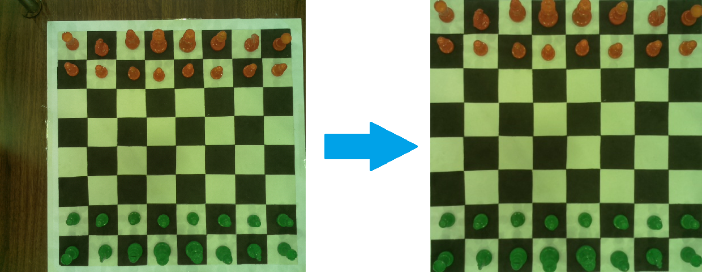
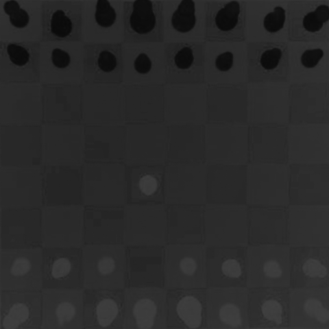
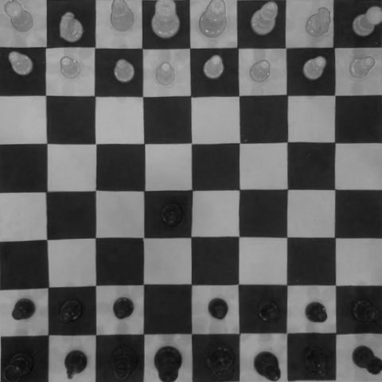
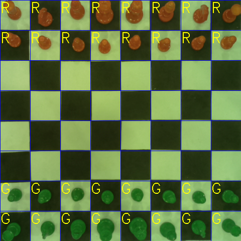

# The Bishop

The Bishop is a project that can help in playing chess, it's entirely open source, based on OpenCV and Python.

### Introduction

The Bishop uses computer vision to recognize where the chess pieces are on the board before deciding what move to make.

### Camera

Vision is done by using a Raspberry Pi camera module attached with an HDMI cable to a fixture directly above the chessboard.

The camera is controlled via Python OpenCV. The raw image is converted to a 480x480px image by warping the perspective so the chessboard squares are equal size and the non-chessboard part of the image is cropped.

## Vision

In this part I will explain in detail how the code works! Let's start with cropping image code.

In the following lines of code, after converting the image to HSV color space I took the lower white and upper white to find the white color surrounding of chessboard.

```python
hsv_image = cv.cvtColor(im, cv.COLOR_BGR2HSV)
lower_white = numpy.array([0, 0, 0], dtype=numpy.uint8)
upper_white = numpy.array([150, 80, 255], dtype=numpy.uint8)
mask = cv.inRange(hsv_image, lower_white, upper_white)
contours, _ = cv.findContours(mask, cv.RETR_TREE, cv.CHAIN_APPROX_NONE)
```

then, I have used approxPolyDP. This allows the approximation of contours into regular polygons and it gives the main coordinates of polygon (in our case a square that means four coordinates)

```python
approx = 0
index1 = []

    for contour in contours:
        if 10000 < cv.contourArea(contour) < 250000:
            cnt_len = cv.arcLength(contour, True)
            approx = cv.approxPolyDP(contour, 0.02 * cnt_len, True)
```

The previous algorithm caused a malfunction in the operation, because it finds the coordinates in a random way that I couldn't determine. So, this was solved by Sorting according to counterclockwise point coordinates like this:


          4---<----3
          |        |
          |        |
          |        |
          1--->----2 

```python
for i in range(4):
    index1.append(tuple(approx[i][0]))

coordinates = index1
center = tuple(map(operator.truediv, reduce(lambda x, y: map(operator.add, x, y), coordinates), [len(coordinates)] * 2))
points = sorted(coordinates, key=lambda coord: (-135 - math.degrees(math.atan2(*tuple(map(operator.sub, coord, center))[::-1]))) % 360)

pts1 = numpy.float32([points[0], points[1], points[2], points[3]])
pts2 = numpy.float32([[0, 480], [480, 480], [480, 0], [0, 0]])
```

Finally, we can use the sorted coordinates to get perspective warp of the image and resize it to 480x480.

```python
matrix = cv.getPerspectiveTransform(pts1, pts2)
result = cv.warpPerspective(im, matrix, (480, 480))
```
And this will be the cropping result:




### How to Determine if a Chessboard Square is Occupied or Empty
The answer may be obvious to us, but how can we write a program that can answer this question as accurately as we can?

Let us take every square in the chessboard and try to determine its color and see if it is occupied or not! So, I took the cropped image,  convert it to hsv color space and split it into its main three channels. Then, it is important to calculate the square size (or its hight and width)  

After that, if we took the "h" image we notice that standard deviation of every pixel in square is equal or more than three if the square is occupied, otherwise it is not occupied. So, I made an 8x8 array that simulates the chessboard and gave "1" value to occupied squares and "0" value to unoccupied ones.




```python
chess_board = numpy.zeros((8, 8))
std_h = numpy.std(pxl_list_h)
if std_h >= 3:
  chess_board[row][colomn] = 1
```
### How to Determine the Chess Piece color
Now, we know the occupied squares. So, we can just check them to determine colors of pieces.

Let us take the "red" image as a gray scale and we notice two situations depending on mean of every pixel in square:
1. Black Squares. mean value: [0, 80]
2. White Squares. mean value: [90, 160]




* Red pieces have the values: [50, 80] in black & [130, 160] in white squares.
* Green pieces have the values: [0, 37] in black & [90, 130] in white squares.

```python
if chess_board[row][colomn] == 1 and 0 < mean_r < 80:   # Black squares
  if mean_r > 50:
    txt2 = 'R'
  if mean_r <= 37:
    txt2 = 'G'
if chess_board[row][colomn] == 1 and 90 < mean_r < 160:  # White squares
    if mean_r > 130:
      txt2 = 'R'
    if mean_r < 130:
      txt2 = 'G'
cv.putText(result, txt2, ((60 * colomn), (60 * row) + 25), 2, 1, (0, 255, 255))
```
This will be the final result:




## License
[](https://opensource.org/licenses/MIT)
